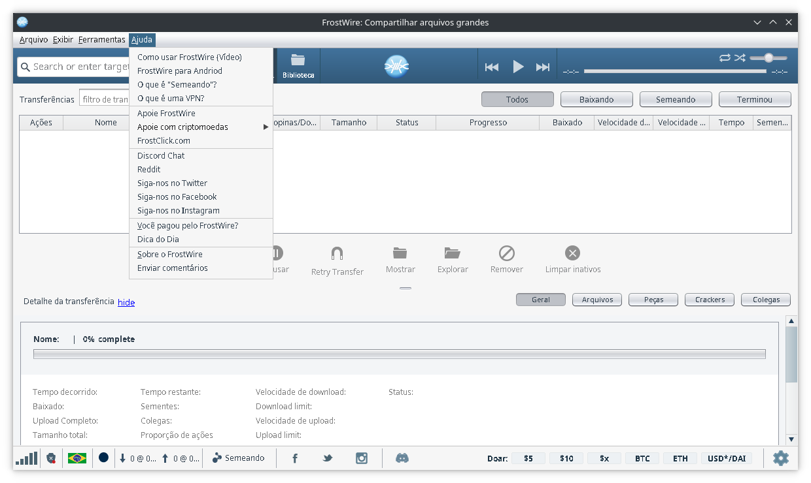
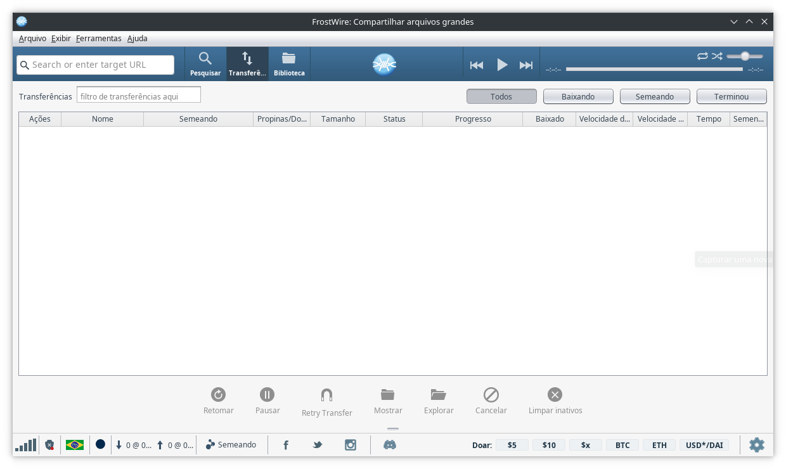

# Como Corrigir Fontes Feias em Aplicativos Java no Linux

Aplicações Java que utilizam Swing ou AWT podem apresentar **fontes serrilhadas**
ou com baixa qualidade no Linux.



Isso acontece porque, por padrão, a máquina virtual Java (JVM) não aplica
suavização de fontes (antialiasing) da mesma forma que o sistema gráfico do Linux.

A solução consiste em habilitar manualmente o antialiasing e outras propriedades
de renderização de texto, tanto de forma **global** (para todas as aplicações Java)
quanto de forma **individual** (apenas para um programa específico).

Essa opção você vai usar quando:
- O sistema não tem um daemon xsettings e você não quer instalar um;

- Você não tem acesso ao código-fonte do programa em Java. 

## 1. Solução global (para todas as aplicações Java)

Você pode adicionar as configurações no seu arquivo de inicialização de sessão,
como `~/.profile`, `~/.bashrc`, `~/.zshrc`, ou até no `/etc/profile`
para afetar todos os usuários do sistema.

Você vai usar uma variável de ambiente para configurar o anti-aliasing:
```bash
_JAVA_OPTIONS="-Dawt.useSystemAAFontSettings=<OPTIONS>"
```

Onde \<OPTIONS\> é um dos valores:

| **Configuração**                   | **Descrição**                                          |
| ---------------------------------- | ------------------------------------------------------ |
| `off`, `false`, `default`          | Sem antialiasing                                       |
| `on`                               | Antialiasing completo                                  |
| `gasp`                             | Usa as instruções de hinting embutidas na fonte        |
| `lcd`, `lcd_hrgb`                  | Antialiasing otimizado para muitos monitores LCD       |
| `lcd_hbgr`, `lcd_vrgb`, `lcd_vbgr` | Alternativas para monitores LCD com diferentes padrões |

As configurações gasp e lcd são os mais recomendados.

Outra opção inclui ativar explicitamente o antialiasing para componentes Swing:
```bash
_JAVA_OPTIONS="-Dswing.aatext=true"
```

Opcionalmente, é possível usar a aparência do GTK adicionando o seguinte:
```bash
_JAVA_OPTIONS='-Dswing.defaultlaf=com.sun.java.swing.plaf.gtk.GTKLookAndFeel'
```

Para configurar todas as opções de antialiasing, é só adicionar a seguinte linha:

```bash
export _JAVA_OPTIONS='-Dawt.useSystemAAFontSettings=on -Dswing.aatext=true'
```

Ao reiniciar a sessão, o problema estará resolvido.



## 2. Solução individual (apenas para um programa)

Se você não quiser aplicar a configuração para todos os programas,
pode rodar uma aplicação Java com os parâmetros diretamente na linha de comando ou
adicionar as opções no script que inicia o programa em java:

```bash
java -Dawt.useSystemAAFontSettings=on -Dswing.aatext=true -jar programa.jar
```

Nesse caso, somente o `programa.jar` usará as configurações de renderização de fontes.

## 3. Fontes TrueType

As fontes TrueType parecem ser o melhor formato suportado pelo Java. Alguns aplicativos
Java podem precisar usar alguma fonte TrueType específica e precisam do caminho do
diretório para a fonte desejada. As fontes TrueType por padrão, são instaladas
no diretório /usr/share/fonts/TTF. Portanto, use:

```bash
JAVA_FONTS="/usr/compartilhar/fontes/TTF"
```

Essa opção também pode ser configurado via profile.

## Conclusão

Com esses ajustes simples, é possível corrigir o problema de fontes feias em
aplicativos Java no Linux. A solução global é prática se você utiliza muitos
programas Java, enquanto a solução individual é ideal para testar ou aplicar
em apenas um software específico.
